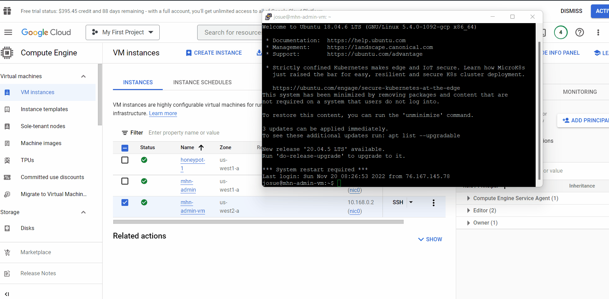
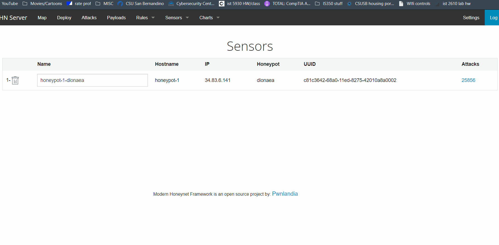

# Unit-10-11-Project-Honeypot
# Honeypot Assignment

**Time spent:** **96** hours spent in total

**Objective:** Create a honeynet using MHN-Admin. Present your findings as if you were requested to give a brief report of the current state of Internet security. Assume that your audience is a current employer who is questioning why the company should allocate anymore resources to the IT security team.

### MHN-Admin Deployment (Required)

**Summary:** How did you deploy it? Did you use GCP, AWS, Azure, Vagrant, VirtualBox, etc.?
I began by trying to use Azure but I could not replocate the steps taken on GCP. Since it is my first time working with honeypots, I decided to use GCP since it was easier to follow along. 

### Dionaea Honeypot Deployment (Required)

**Summary:** Briefly in your own words, what does dionaea do?
Dionaea's purpose is to capture bugs, malware and other shellcodes during an attack. 

### Database Backup (Required) 

**Summary:** What is the RDBMS that MHN-Admin uses? What information does the exported JSON file record?
MHN-Admin uses javascript object notation to store various payload attacks. It records what port number was targeted, time occured, source port, source IP, identifier, and type of honeypot attacked (in this case it was Dionaea). 
*Be sure to upload session.json directly to this GitHub repo/branch in order to get full credit.*

## Notes

Describe any challenges encountered while doing the assignment.
Challenges faced were exporting json file and creating gifs. On windows the screen record method does not allow you to record certain programs on screen. 
